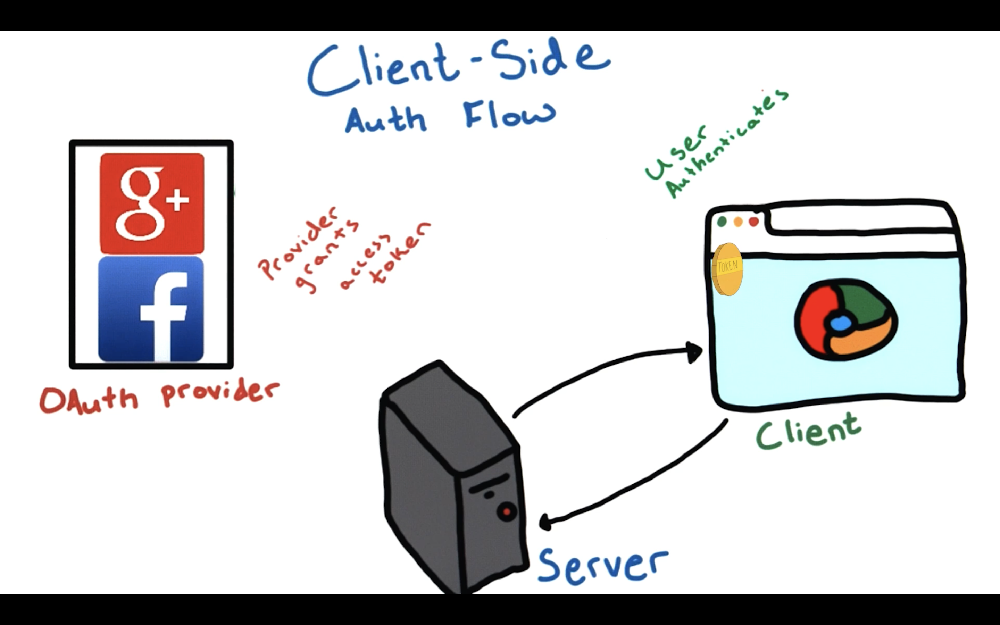
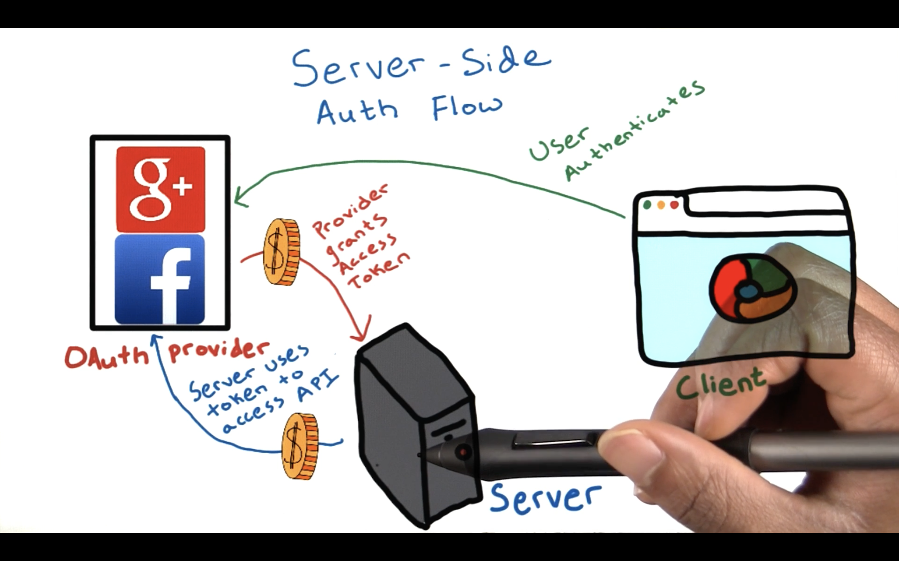

Now that you have a basic understanding of authentication and authorization, it's time to see how OAuth2 makes it all happen. In this lesson, you're going to learn about the different types of OAuth implementations, also known as OAuth flows. And then you'll use one of these flows to add security to an existing web application.

----

# Types of flow

The term **flow** in web security refers to the way information is exchanged between a client, a server and OAuth provider to ensure secure communication across the internet.

The specifications for OAuth2 provide a lot of flexibility for developers to implement a security flow that works best for the project at hand.

## Client-side Auth Flow

OAuth allows for a flow that can happen on the client side. This means that all of the code to authenticate the user is initiated via JavaScript from the user's browser. This implementation is very useful for single-page browser-based web applications.

OAuth also supports mobile authorization, such that mobile device apps can authenticate and gain access similarly to a browser.

## Server-side Auth Flow
Another possible and very popular flow is on the server side. Server-side flow allows the server to obtain an access token to allow the server to make API requests on behalf of the user.

The user has the option tp set a timeout or revoke access to these tokens at any time.

## Pros and Cons

Each of these implementations has various pros and cons.

**Client-side authentication** is quick and easy, but a lot of trust is placed on the browser or mobile device, and the server cannot make API calls to the OAuth provider on behalf of the user.

**Server-side implementation** gives more power to a server-side application, but the server is now responsible for securely implementing session checking for its users and secure storage of these access tokens.

Choosing the right OAuth flow for an application really depends on the specific needs of a particular application. If you're interested in learning more about each of these flows, check out **[this blog](https://aaronparecki.com/articles/2012/07/29/1/oauth2-simplified)** that explains some of the flow options using OAuth 2.0.

Google+ uses a hybridized flow for logins that requires authentication to happen on the client, but allows the server to make API calls on behalf of the client.

This lesson will focus on the design and implementation of this hybridized flow.
