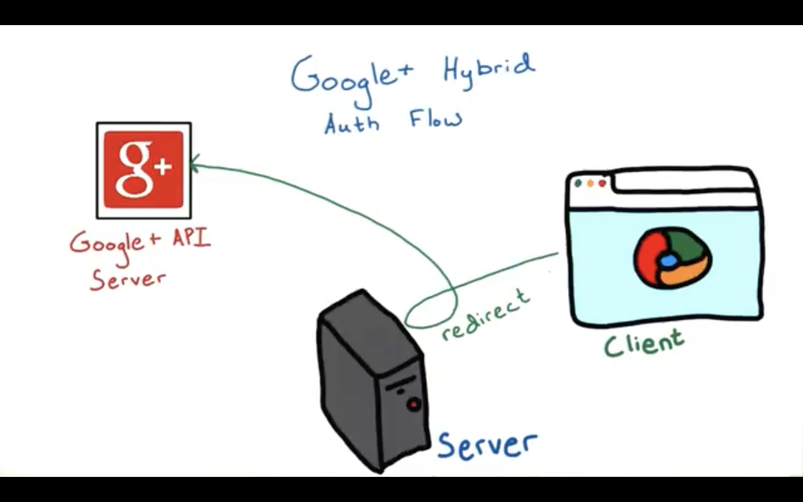
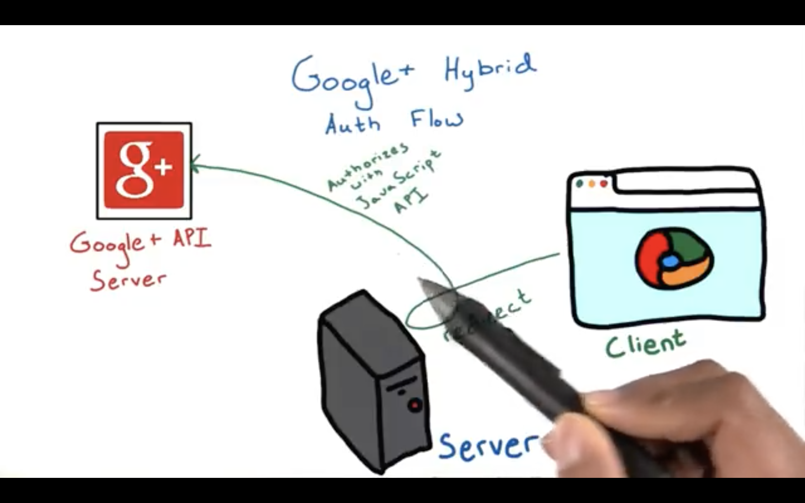
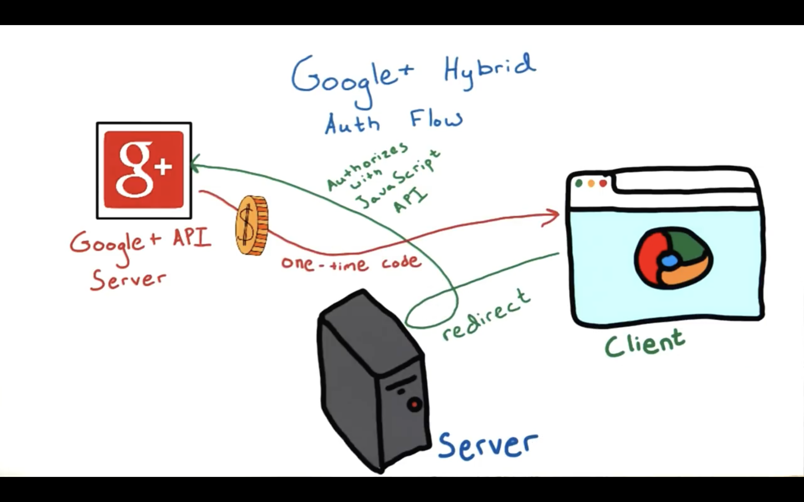
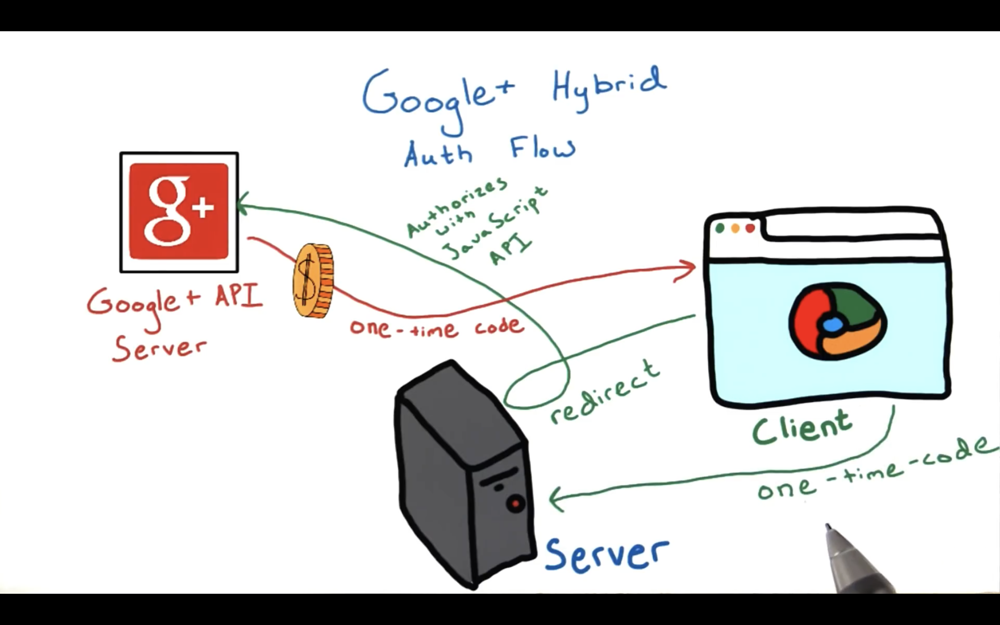
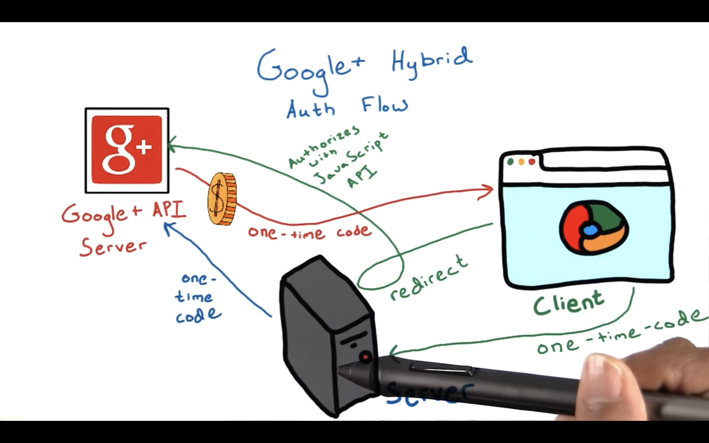
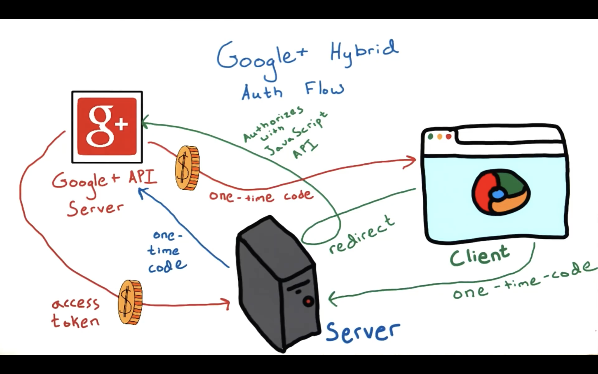
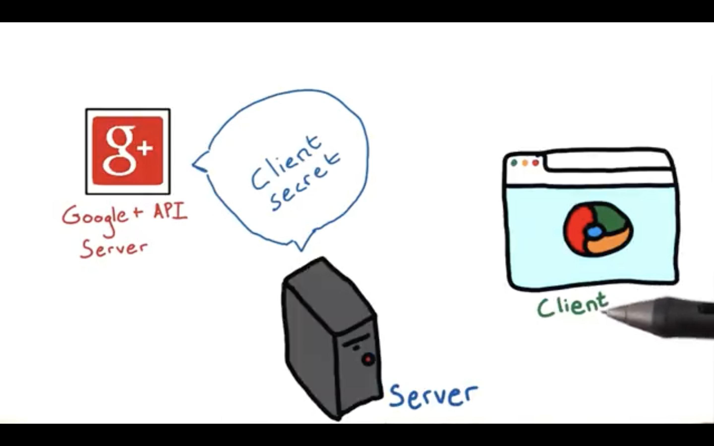

# Google+ Auth for server side apps

Google strongly recommends using a hybridized auth flow in order to take advantage of all the benefits of a Google Plus sign in. Let's see how this flow works.

#### Step 1: A user opts to log in with the Google account...
... and is redirected to a Google Portal for granting access to your application.

#### Step 2: The user authorizes your app on the client side...
... using the JavaScript API client.

#### Step 3: The Google server sends a one-time code...
... along with an access token back to the client.

#### Step 4: The client then sends this same special one-time code...
... back to your server.

#### Step 5: Then your server relays this one-time code...
... back to the Google API server.

#### Step 6: And in return, your server's given an access token from Google...
... enabling it to make its own API calls, which can be done even when the user's offline.

This one-time code flow has a security advantage over a pure server side flow. This is because, with one-time codes,
Google provides tokens directly to your server, without any intermediaries. Even if a one-time code is discovered, it is extremely hard to use without your application's **client secret**.

A **client secret** is a special code Google issues to verify your application. You will make a client secret in your first app in just a few minutes.

