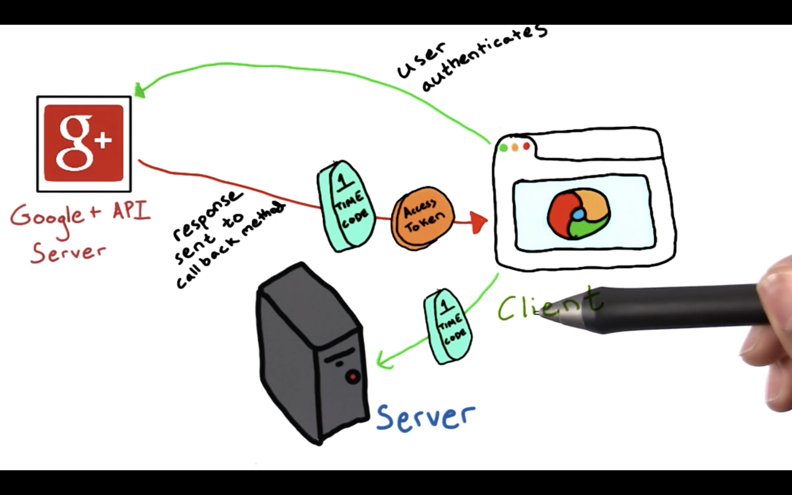

# Step 4 - Make a Callback Method

So we've written the code that goes out to Google to authenticate. Now let's write a callback method to handle the response that Google sends to the client. Remember that along with a successful response, the Google API server will also provide a one-time code to authorize our server, and an access token that the client can use to make API calls from within the browser as well.


Just before the closing `body` tag in my *login.html* page, I'm going to add opening and closing script tags. Inside them, I will define the `signInCallback` function that takes in an `authResult` object as input.
```
<script>
function signInCallback(authResult) {
}
</script>
```
If that object contains a parameter called `code`, then we know that the authorization with the Google API server was successful, and our one time use code is present.
```
<script>
function signInCallback(authResult) {
    if (authResult['code']) {

    }
}
</script>
```
Now that the app has been authorized, we can hide the Google+ sign in button.
```
<script>
function signInCallback(authResult) {
    if (authResult['code']) {
        $('#signinButton').attr('style', 'display: none')
    }
}
</script>
```

Now, I will use jQuery to create an Ajax call that passes the one-time code Google gave the client on to the server.
```
<script>
function signInCallback(authResult) {

    if (authResult['code']) {

        $('#signinButton').attr('style', 'display: none')

        $.ajax({
            type: 'POST',
            url: '/gconnect?state={{STATE}}',
            processData: false,
            contentType: 'application/octet-stream; charset=utf-8',
            data: authResult['code'],
        })

    }

}

</script>
```
* The URL this method will call I will name `/gconnect`.  I will define this method on my server on **Step 5**.

* Along with this method I pass the server `state` token as an argument to verify against the cross-site reference forgery attack. In order to populate this variable when the template is rendered, we need to pass it to the `render_template` function, like so:
    ```
    def showLogin():
        state = ''.join(random.choice(string.ascii_uppercase + string.digits) for x in xrange(32))
        login_session['state'] = state
    ★   return render_template('login.html', STATE=state)
    ```

* Setting `processData` to `false` indicates that we do not want jQuery to process the response into a string.

* Furthermore, this `application/octet-stream` indicates that we are sending an arbitrary binary stream of data, and the `charset=utf-8` indicates that it is formatted using a universal character set called Unicode.

* With `data: authResult['code']` we specify the data that we're going to send along to our server, the one-time use code.

When we receive a `200` or a successful response code from our server, let's return a successful login message to the user, and then redirect the main restaurant's page after about four seconds.
```
success: function(result) {
    if (result) {
        $('#result').html('Login Successful!<br>' + result + '<br>Redirecting...')
        setTimeout(function() {
            window.location.href = '/restaurant';
        }, 4000);
     }
 }
```
If the server has any additional response information to pass to the client, we can present it with this result variable. So let's go ahead and add an empty `div` named `result` that we can populate with a response method just above the opening `script` tag.
```
<div id='result'></div>
```
In the event that an error was returned by Google, I will report this error to the console.log:
```
console.log('There was an error: ' + authResult['error']);
```
In the event that no response was returned by my server to the callback function, I will return this error message to my result `div`:
```
else {
    $('#result').html('Failed to make a server-side call. Check your configuration and console.');
}
```
And so the complete ajax request looks like this:
```
$.ajax({
    type: 'POST',
    url: '/gconnect?state={{STATE}}',
    processData: false,
    contentType: 'application/octet-stream; charset=utf-8',
    data: authResult['code'],
       success: function(result) {
           if (result) {
               $('#result').html('Login Successful!<br>' + result + '<br>Redirecting...')
               setTimeout(function() {
                   window.location.href = '/restaurant';
               }, 4000);
           } else if (authResult['error']) {
                console.log('There was an error: ' + authResult['error']);
           } else {
               $('#result').html('Failed to make a server-side call. Check your configuration and console.');
           }
       }
})
```

You can view a complete version of *login.html* now with the added callback function **[here](https://github.com/udacity/ud330/blob/master/Lesson2/step4/templates/login.html)**.
